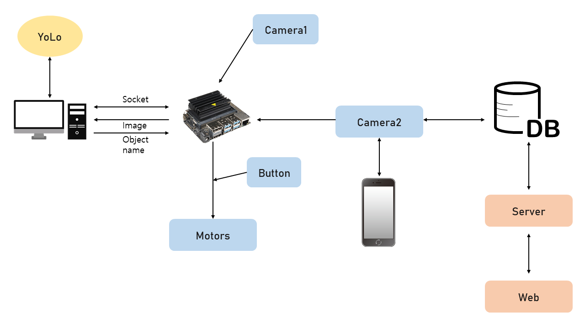

# Capstone_design
Global Capstone Design (01-09-20 ~ 01-16-20)

## Topic
+ Sustainable living in the New Normal

## Motivation
+ The idea behind is that The Recycling industry is impacted by COVID-19.
+ After corona virus is broken out, it has become pandemic over the world.
+ The number of people, nowadays, order delivery food more than before due to lockdown and social distance. The percentages of recycling items which are possibly recycled dropped from 60% to 40%.
+ This result is serious problem for our environment. So It is essential to recycle better.

## System design

## How it works
1. Put any recycling items in the machine.
2. Wait until the machine detect whether it can be recycled or not..
3. If the item is available to recycle, it will fell down in the trash bin.
4. Get the reward depends on how many you put and which object you put.

## Reference
+ https://github.com/pjreddie/darknet
+ https://github.com/JetsonHacksNano/CSI-Camera
